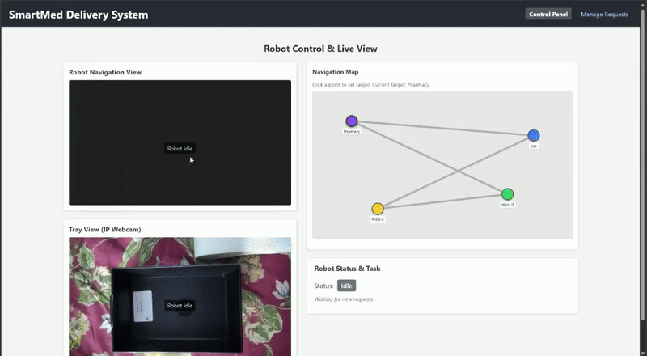

<div align="center">

# 🤖 MEDICAL ASSISTIVE WEB ROBOT

### An Autonomous Hexapod Robot for Healthcare Environments

[](http://wiki.ros.org/melodic)
[](https://developer.nvidia.com/embedded/jetson-nano-developer-kit)
[](https://reactjs.org/)
[](https://www.python.org/)
[](LICENSE)

<p align="center">
  
</p>

*A collaborative project integrating **Robotics** and **Mathematics for Computing** — Amrita Vishwa Vidyapeetham*

</div>

---

## 📋 Table of Contents

- [Overview](#-overview)
- [Features](#-features)
- [System Architecture](#-system-architecture)
- [Hardware Requirements](#-hardware-requirements)
- [Software Stack](#-software-stack)
- [Project Structure](#-project-structure)
- [Installation](#-installation)
- [Usage](#-usage)
- [Demo](#-demo)
- [Team](#-team)
- [Acknowledgments](#-acknowledgments)
- [License](#-license)

---

## 🎯 Overview

The **Medical Assistive Web Robot** is an autonomous navigation system designed for hospital environments. Built on the **Hiwonder JetHexa** hexapod robot and powered by **NVIDIA Jetson Nano**, this project demonstrates real-world applications of:

- **SLAM (Simultaneous Localization and Mapping)** using RTAB-Map
- **Autonomous Navigation** with ROS Navigation Stack
- **Real-time Web Control** replacing traditional RViz interfaces
- **Voice-Activated Commands** for hands-free operation

> 💡 **Key Innovation**: A browser-based control interface that enables healthcare staff to monitor and command the robot without specialized software installation.

---

## ✨ Features

| Feature | Description |
|---------|-------------|
| 🏥 **Autonomous Navigation** | Navigate to hospital rooms using web-based goal setting |
| 🗺️ **Real-time SLAM** | Live 2D occupancy grid mapping with RTAB-Map |
| 🌐 **Web Interface** | React-based dashboard with ROS3D visualization |
| 🔊 **Voice Control** | Speech recognition for hands-free directional commands |
| ⚠️ **Obstacle Avoidance** | Dynamic Window Approach (DWA) for safe navigation |
| 📡 **Live Tracking** | Real-time robot position and sensor data streaming |
| 🎮 **Multiple Control Modes** | Keyboard, joystick, web click-to-navigate, and voice |

---

## 🏗️ System Architecture

```
┌─────────────────────────────────────────────────────────────────────┐
│                         USER INTERFACE LAYER                         │
├─────────────────┬──────────────────────┬────────────────────────────┤
│   Web Browser   │   Voice Controller   │   Keyboard/Joystick        │
│   (React App)   │   (Speech Recognition)│   (Direct Control)        │
└────────┬────────┴──────────┬───────────┴─────────────┬──────────────┘
         │                   │                         │
         ▼                   ▼                         ▼
┌─────────────────────────────────────────────────────────────────────┐
│                        ROSBRIDGE WEBSOCKET                          │
│                    (Real-time Communication)                         │
└─────────────────────────────────┬───────────────────────────────────┘
                                  │
                                  ▼
┌─────────────────────────────────────────────────────────────────────┐
│                         ROS MIDDLEWARE                               │
├─────────────────┬──────────────────────┬────────────────────────────┤
│   Navigation    │      SLAM            │      Sensor Fusion         │
│   (move_base)   │   (RTAB-Map)         │   (robot_localization)     │
├─────────────────┼──────────────────────┼────────────────────────────┤
│  Global Planner │  Occupancy Grid      │   EKF Odometry             │
│  (Dijkstra)     │  Generation          │   (IMU + Wheel Odom)       │
├─────────────────┼──────────────────────┼────────────────────────────┤
│  Local Planner  │  Loop Closure        │   Laser Odometry           │
│  (DWA)          │  Detection           │   (rf2o)                   │
└────────┬────────┴──────────┬───────────┴─────────────┬──────────────┘
         │                   │                         │
         ▼                   ▼                         ▼
┌─────────────────────────────────────────────────────────────────────┐
│                        HARDWARE LAYER                                │
├─────────────────┬──────────────────────┬────────────────────────────┤
│  RPLIDAR S2L    │   Jetson Nano        │   JetHexa Hexapod          │
│  (2D LiDAR)     │   (Compute Unit)     │   (18-DOF Robot)           │
└─────────────────┴──────────────────────┴────────────────────────────┘
```

---

## 🔧 Hardware Requirements

| Component | Specification |
|-----------|---------------|
| **Robot Platform** | Hiwonder JetHexa (18-DOF Hexapod) |
| **Compute Unit** | NVIDIA Jetson Nano 4GB |
| **LiDAR Sensor** | Slamtec RPLIDAR S2L (2D, 360°) |
| **Controller** | Hiwonder Bus Servo Controller |
| **Power Supply** | 11.1V 3S LiPo Battery |
| **Optional** | Wireless Handle / Gamepad |

---

## 💻 Software Stack

### Robot Side (Jetson Nano)
| Software | Version | Purpose |
|----------|---------|---------|
| Ubuntu | 18.04 LTS | Operating System |
| ROS | Melodic | Robot Operating System |
| RTAB-Map | 0.20+ | SLAM & Mapping |
| move_base | - | Autonomous Navigation |
| rosbridge_suite | - | WebSocket Communication |
| robot_localization | - | Sensor Fusion (EKF) |

### Client Side (Web Interface)
| Technology | Version | Purpose |
|------------|---------|---------|
| React | 19.0 | Frontend Framework |
| roslib.js | 1.4.1 | ROS JavaScript Library |
| ros3d.js | 1.1.0 | 3D Visualization |
| Three.js | 0.174 | WebGL Rendering |

### Voice Control (ROS2 Package)
| Library | Purpose |
|---------|---------|
| SpeechRecognition | Voice-to-Text |
| sounddevice | Audio Recording |
| gTTS | Text-to-Speech Feedback |
| pynput | Keyboard Activation |

---

## 📁 Project Structure

```
MEDICAL-ASSISTIVE-WEB-ROBOT/
│
├── 📁 Launch codes/                    # ROS Launch Files
│   ├── amcl.launch                     # Adaptive Monte Carlo Localization
│   ├── lidar.launch                    # LiDAR sensor initialization
│   ├── move_base.launch                # Navigation stack
│   ├── rospider_navigation.launch      # Main navigation launcher
│   ├── rospider_ekf.launch             # Extended Kalman Filter
│   ├── rf2o_laser_odometry.launch      # Laser-based odometry
│   ├── keyboard_control.py             # Keyboard teleoperation
│   └── rospider_controller_main.py     # Robot controller
│
├── 📁 rosbridgetest/                   # React Web Interface
│   ├── src/
│   │   ├── App.js                      # Main application
│   │   └── components/
│   │       └── RosMapViewer.js         # 3D Map visualization
│   ├── public/
│   └── package.json
│
├── 📁 voice_controller_my_robot/       # ROS2 Voice Control Package
│   ├── voice_controller_my_robot/
│   │   ├── voice_recorder.py           # Speech recognition node
│   │   ├── pose_publish_from_room_number.py
│   │   └── keyboard_activator.py
│   ├── data/
│   │   └── rooms_data.json             # Room coordinates mapping
│   ├── launch/
│   │   └── voice_controller.launch.py
│   └── package.xml
│
├── 📁 websockettest/                   # WebSocket Testing
│   └── js/
│       ├── roslib.min.js
│       └── ros2d.min.js
│
├── 📁 Proof/                           # Demo Videos & Screenshots
│   └── Web_Interface_gif.gif
│
├── 📄 README.md                        # Project Documentation
└── 📄 Report_Format_AIR.docx           # Academic Report
```

---

## 🚀 Installation

### Prerequisites

- Ubuntu 18.04 LTS on Jetson Nano
- ROS Melodic installed
- Node.js 16+ (for web interface)
- Python 3.8+

### 1️⃣ Clone the Repository

```bash
git clone https://github.com/sanggitsaaran/MEDICAL-ASSISTIVE-WEB-ROBOT.git
cd MEDICAL-ASSISTIVE-WEB-ROBOT
```

### 2️⃣ Robot Setup (Jetson Nano)

```bash
# Install ROS dependencies
sudo apt-get update
sudo apt-get install ros-melodic-rtabmap-ros ros-melodic-navigation \
    ros-melodic-robot-localization ros-melodic-rosbridge-suite

# Copy launch files to your catkin workspace
cp -r "Launch codes"/* ~/catkin_ws/src/your_robot_package/launch/

# Build the workspace
cd ~/catkin_ws && catkin_make
source devel/setup.bash
```

### 3️⃣ Web Interface Setup

```bash
cd rosbridgetest
npm install
npm start
```

### 4️⃣ Voice Controller Setup (ROS2)

```bash
cd ~/ros2_ws/src
cp -r voice_controller_my_robot .
cd ~/ros2_ws
colcon build --packages-select voice_controller_my_robot
source install/setup.bash
```

---

## 📖 Usage

### Starting the Robot

```bash
# Terminal 1: Launch robot base and sensors
roslaunch your_robot_package rospider_navigation.launch

# Terminal 2: Start ROSBridge for web communication
roslaunch rosbridge_server rosbridge_websocket.launch

# Terminal 3: Launch SLAM
roslaunch rtabmap_ros rtabmap.launch
```

### Accessing the Web Interface

1. Ensure the robot and your computer are on the same network
2. Update the WebSocket URL in `RosMapViewer.js`:
   ```javascript
   url: 'ws://YOUR_JETSON_IP:9090'
   ```
3. Open browser and navigate to `http://localhost:3000`
4. Click on the map to set navigation goals!

### Voice Control Commands

```bash
# Launch voice controller
ros2 launch voice_controller_my_robot voice_controller.launch.py

# Supported commands (French/English):
# - "Salle [number]" / "Room [number]" - Navigate to room
# - "Avance" / "Forward" - Move forward
# - "Arrete" / "Stop" - Stop movement
```

---

## 🎬 Demo

<div align="center">

### Web Interface in Action


*Real-time SLAM visualization with click-to-navigate functionality*

</div>

---

## 👥 Team

<table align="center">
  <tr>
    <td align="center">
      <strong>Sanggit Saaran K C S</strong><br>
      <sub>CB.SC.U4AIE23247</sub><br>
      <a href="https://github.com/sanggitsaaran">GitHub</a>
    </td>
    <td align="center">
      <strong>Surya Ha</strong><br>
      <sub>CB.SC.U4AIE23267</sub>
    </td>
    <td align="center">
      <strong>Vishal Seshadri B</strong><br>
      <sub>CB.SC.U4AIE23260</sub>
    </td>
    <td align="center">
      <strong>Venkatram K S</strong><br>
      <sub>CB.SC.U4AIE23236</sub>
    </td>
  </tr>
</table>

---

## 🎓 Academic Context

This project was developed as part of:

| Course | Details |
|--------|---------|
| **Program** | B.Tech Artificial Intelligence Engineering |
| **Institution** | Amrita Vishwa Vidyapeetham, Coimbatore |
| **Semester** | 4th Semester (2024-25) |
| **Courses** | Robotics (AIR) + Mathematics for Computing (MFC) |

### Mathematical Concepts Applied

- **Dijkstra's Algorithm** — Global path planning
- **Extended Kalman Filter** — Sensor fusion for localization
- **Graph-based SLAM** — Map optimization with RTAB-Map
- **Dynamic Window Approach** — Real-time trajectory optimization

---

## 🙏 Acknowledgments

- **Hiwonder** for the JetHexa platform and documentation
- **NVIDIA** for Jetson Nano developer resources
- **ROS Community** for extensive robotics libraries
- **Amrita Vishwa Vidyapeetham** faculty for guidance and support

---

## 📄 License

This project is licensed under the MIT License - see the [LICENSE](LICENSE) file for details.

---

<div align="center">

### ⭐ Star this repository if you found it helpful!

**Made with ❤️ by Team JetHexa**

[](https://github.com/sanggitsaaran/MEDICAL-ASSISTIVE-WEB-ROBOT/stargazers)

</div>
